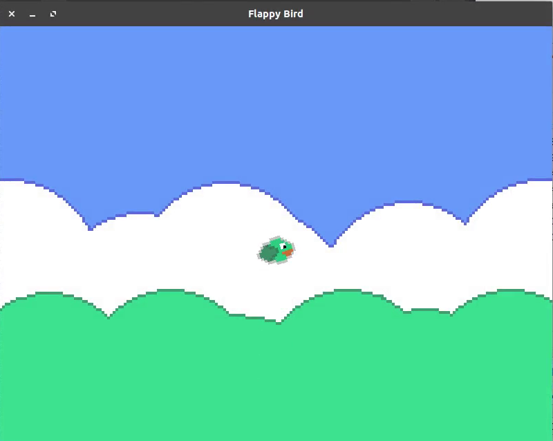

# Flappy Bird Clone




To compile: 

1. Download g++ and qt libraries.

```bash
sudo apt install build-essential libsfml-dev -y
```

2. Start compiling

```bash
make game
```

3. Run the game

```
./game
```

To clean up the binaries and objects:

```bash
make clean
```

Thank you :D